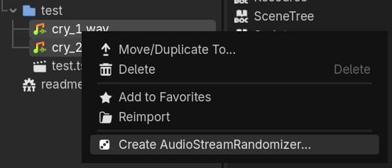
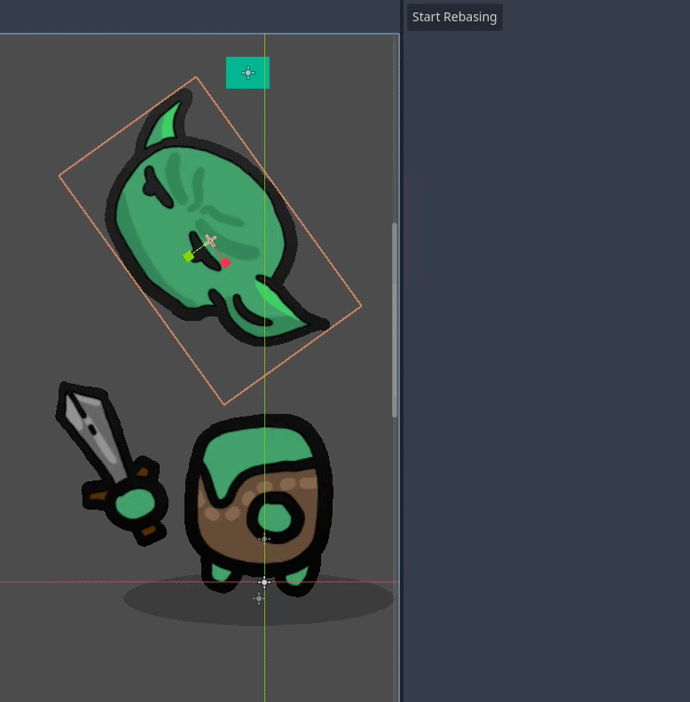

`Godot Editor Tweaks` is a small addon for the [Godot](https://godotengine.org/) game Engine which adds a number of convenience features. This is primarily a testing ground for features or workflows which I want to see implemented in Engine.

### How to Use

This addon is not currently in the Godot Asset Library, so if you want to use this addon you will need to download from github. The easiest way to do this is to use the `Code -> Download Zip` option. Drag the `addons/editor_tweaks` folder into your project.

You will need to enable the plugin in `Project -> Project Settings -> Plugins`.

# Features

## Create Actor

The "actor" flow defined in this plugin just automates the standard practice of creating a folder, scene, and script file, all with a shared name.

You can use it for creating actors, components, levels, etc. Really anything that matches this format.

The scene and script will both automatically be opened for editing, and the script will be attached to the root node of the scene, which will also be named correctly. 

## Sound Randomizer

Right-click a range of sound assets and quickly bundle them into a new AudioStreamRandomizer asset.

## Animation Rebasing

A new panel is introduced, which allows rebasing animations. In a nutshell, this is a utility for shifting *all* key-frames by a certain delta. 

For example, in the following gif, the *relative motion* of the attack is correct, but the goblins head is shifted and rotated.

Fixing this normally requires editing everysingle key-frame, or simple re-creating the animation. With animation rebasing, you can repair the incorrect offset, and it apply it across the full animation.

Click 'Start Rebasing' to tell the tool you want to start rebasing. This saves the current value of every animated field. 

Next, change any number of animated properties.

When you click apply, your change will be compared to the originally value, and the delta will be applied across every field of every key frame of every animation.

It's a bit like a multi-edit tool for animations.

# Version History

## 1.6.1 

- Renamed 'create_actor' folder to 'editor_tweaks'

## 1.6.0

 - Removes ability to use @export vars with drag+drop (integrated into Godot itself!)
## 1.5.0

 - Adds dock for animation rebasing

## 1.4.0

 - Add ability to use @export vars with drag+drop

## 1.3.0

 - Added 'Create AudioStreamRandomizer support

## 1.2.0

 - Added keyboard shortcut to open the create_actor menu.

## 1.1.0

- Added option to create `C#` scripts as well as GDScript files
- Added option to change the location of the created actor.
- Added ClassName automatically to GDScript template

## 1.0.0

Initial release of the plugin, offering basic 'Create Actor' support.
